# 📍 PinPoint

**PinPoint** é uma aplicação web interativa baseada em mapas que permite ao usuário **buscar locais**, **interagir diretamente com o mapa**, **visualizar informações geográficas** (latitude, longitude e endereço) e **salvar locais** de forma persistente.

O projeto foi desenvolvido com foco em **boas práticas de Front-End**, **arquitetura limpa**, **componentização**, **responsividade** e **integração com APIs externas**.

---

## 🎯 Objetivo do Projeto

O PinPoint foi criado com o objetivo de demonstrar, na prática, conhecimentos essenciais para um desenvolvedor front-end moderno, incluindo:

- Estruturação de aplicações React de forma profissional
- Organização de código baseada em funcionalidades (feature-based architecture)
- Uso correto de APIs externas
- Gerenciamento de estado local, global e derivado
- Separação clara entre lógica, apresentação e efeitos colaterais
- Atenção à experiência do usuário (UX) e responsividade

---

## 🧭 Funcionalidades

- 🔍 **Busca de locais** utilizando Google Places Autocomplete  
- 🗺️ **Interação direta com o mapa** (clique para selecionar um ponto)  
- 📌 **Exibição de latitude e longitude** do ponto selecionado  
- 📍 **Reverse geocoding** (coordenadas → endereço)  
- ⭐ **Salvar locais**  
- 📋 **Listagem de lugares salvos** com interação  
- 🧠 **Centralização automática do mapa** ao selecionar um local  
- 🧾 **Exibição de detalhes de estabelecimentos (POI)**  
- 💾 **Persistência dos favoritos no navegador**  
- 📱 **Layout totalmente responsivo**, com comportamento específico para mobile  

---

## 📸 Demonstração

### Desktop

### Tela incial
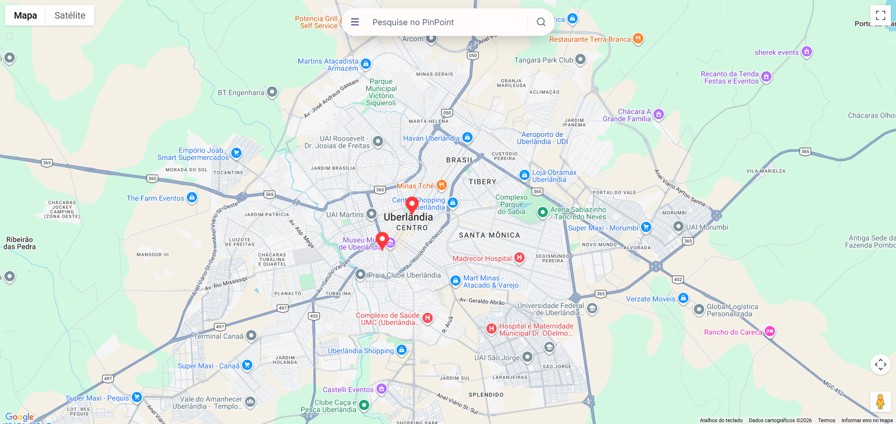

### Lista de locais salvos
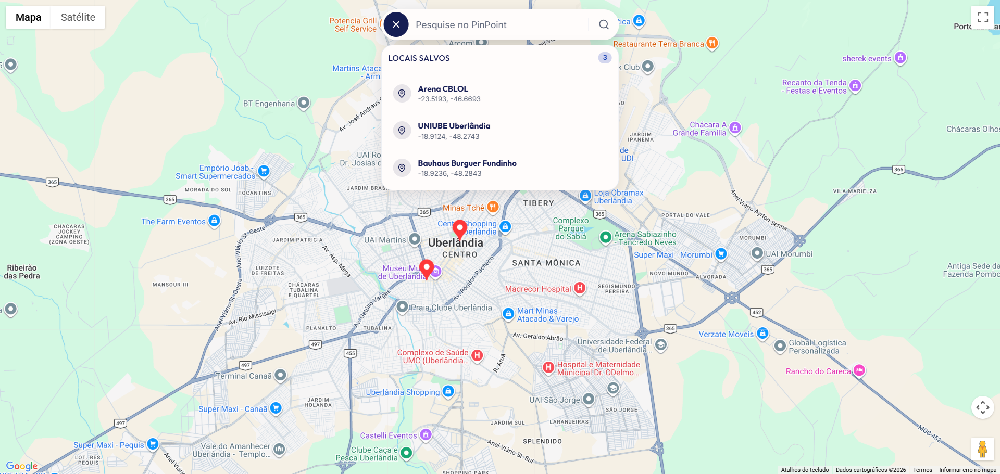

## Busca de locais com Google Places Autocomplete
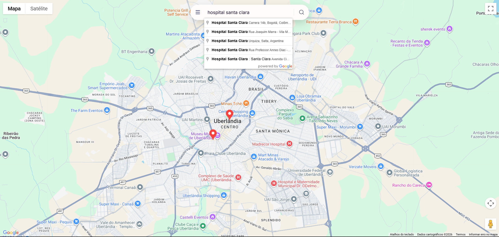

### Salvamento de locais
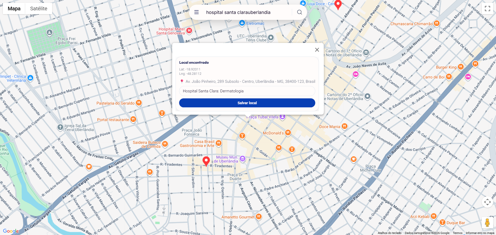

### Marcador de local salvo exibido no mapa


### Janela de informações de um estabelecimento no mapa
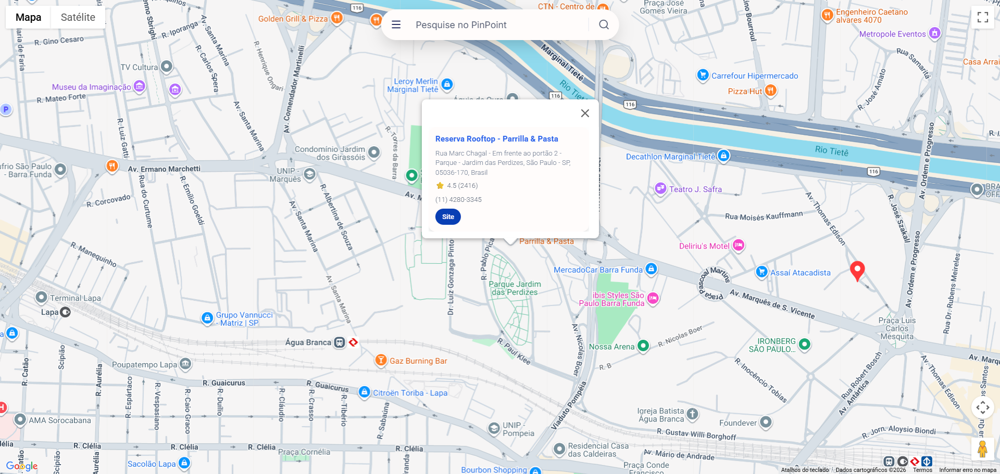


### Mobile

### Tela incial
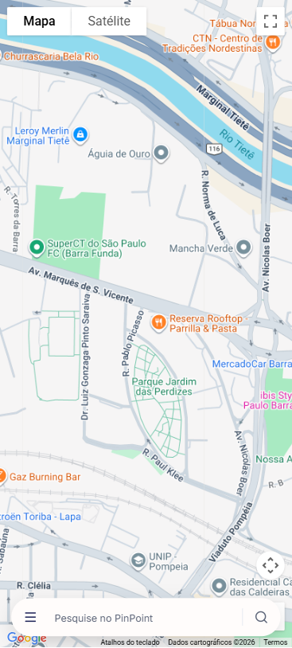

### Lista de locais salvos
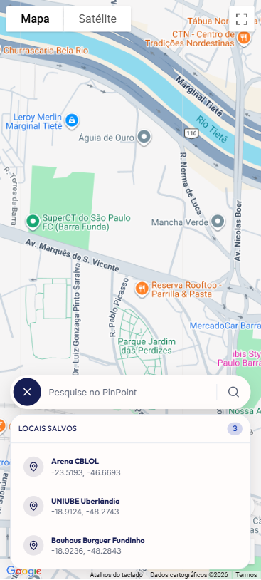

## Busca de locais com Google Places Autocomplete
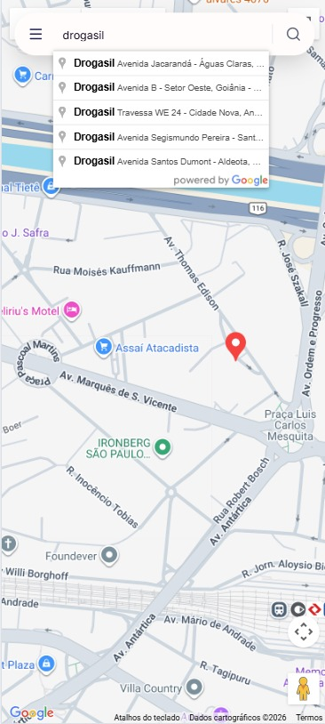

### Salvamento de locais
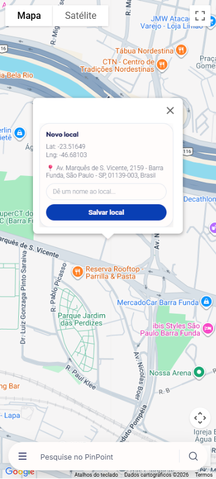

### Marcador de local salvo exibido no mapa
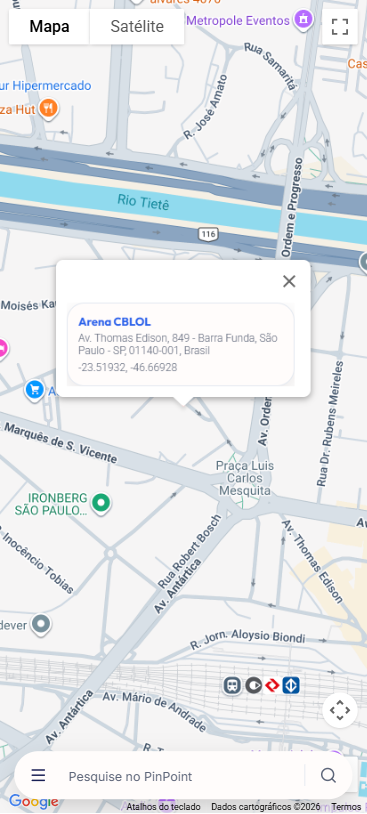

### Janela de informações de um estabelecimento no mapa
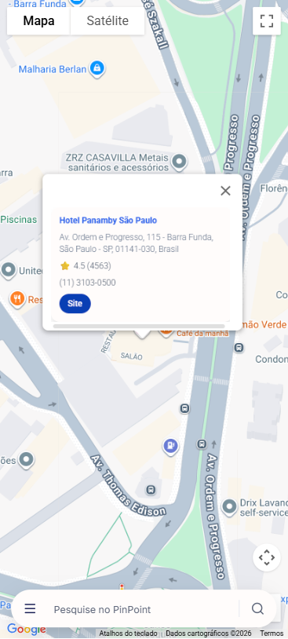


---

## 🛠️ Tecnologias Utilizadas

### Core
- **React** (com Vite)
- **JavaScript (ES6+)**

### Mapas e APIs
- **Google Maps JavaScript API**
- **Google Places API**
- **@vis.gl/react-google-maps**

### Gerenciamento de Estado e Dados
- **React Query (TanStack Query)** – gerenciamento de requisições assíncronas, loading, erro e cache
- **Zustand** – estado global simples, performático e persistente

### Estilização
- **Tailwind CSS** – estilização utilitária, responsiva e consistente
- **Lucide React** – biblioteca de ícones

---

## 🧠 Arquitetura do Projeto

O projeto utiliza **arquitetura baseada em features**, uma abordagem comum em aplicações profissionais por facilitar manutenção, escalabilidade e leitura do código.

### Estrutura de pastas

```txt
src/
├─ features/
│  ├─ search/
│  │  ├─ components/
│  │  │  ├─ Search.jsx
│  │  │  ├─ SearchBar.jsx
│  │  │  └─ FavoritesMenu.jsx
│  │  ├─ hooks/
│  │  │  └─ usePlacesAutocomplete.js
│  │  └─ index.js
│  │
│  └─ map/
│     ├─ components/
│     │  ├─ Map.jsx
│     │  ├─ MapView.jsx
│     │  ├─ MapController.jsx
│     │  ├─ FavoriteMarkers.jsx
│     │  ├─ ClickMarker.jsx
│     │  ├─ LocationInfoWindow.jsx
│     │  └─ PlaceInfoWindow.jsx
│     ├─ hooks/
│     │  ├─ useReverseGeocode.js
│     │  └─ usePlaceDetails.js
│     ├─ utils/
│     │  └─ normalizeLatLng.js
│     └─ index.js
│
├─ services/
│  └─ googleMapsService.js
│
├─ store/
│  └─ useStore.js
│
├─ App.jsx
└─ main.jsx


## 📦 Separação de Responsabilidades

O projeto foi estruturado de forma a manter uma **separação clara de responsabilidades**, facilitando a leitura, manutenção e evolução do código.

Cada parte da aplicação possui um papel bem definido:

- **Componentes** são responsáveis apenas pela interface (UI)
- **Hooks customizados** concentram lógica de negócio e efeitos colaterais
- **Services** lidam exclusivamente com comunicação com APIs externas
- **Store global** centraliza estados compartilhados

Essa separação evita acoplamento excessivo, reduz duplicação de código e torna o projeto mais previsível.

---

## 🔄 Fluxo da Aplicação

O funcionamento da aplicação segue um fluxo simples e bem definido:

1. O usuário pode buscar um local pelo campo de busca (Autocomplete)
2. Ou clicar diretamente em qualquer ponto do mapa
3. O mapa é automaticamente centralizado na localização selecionada
4. As coordenadas (latitude e longitude) são exibidas
5. O endereço é obtido via reverse geocoding
6. O usuário pode salvar o local como favorito
7. Os favoritos ficam disponíveis para seleção posterior

Esse fluxo foi pensado para ser **intuitivo**, **direto** e **sem etapas desnecessárias**.

---

## 🧠 Gerenciamento de Estado

O gerenciamento de estado foi dividido conforme a responsabilidade de cada dado:

### Estado Local (`useState`)
Utilizado para estados temporários e específicos de componentes, como:
- posição clicada no mapa
- texto digitado no input
- controle de menus e janelas
- elementos selecionados momentaneamente

### Estado Global (Zustand)
Utilizado para dados que precisam ser compartilhados entre componentes, como:
- lista de locais favoritos
- persistência no `localStorage`

O Zustand foi escolhido por ser simples, performático e exigir pouco boilerplate, mantendo o código limpo.

### Estado Derivado
Sempre que possível, estados são derivados de outras fontes (ex: React Query), evitando duplicação e sincronizações manuais.

---

## 🌐 Integração com APIs

A aplicação integra diferentes serviços do Google Maps:

- **Google Places Autocomplete**  
  Utilizado para busca e sugestão de locais no campo de pesquisa

- **Google Place Details**  
  Utilizado para obter informações detalhadas de estabelecimentos (POIs)

- **Reverse Geocoding**  
  Utilizado para converter coordenadas geográficas em endereços legíveis

As requisições assíncronas são gerenciadas com **React Query**, que cuida de:
- loading
- tratamento de erro
- cache
- revalidação automática de dados

---

## 📱 Responsividade

A interface foi projetada com foco em **usabilidade em diferentes tamanhos de tela**, utilizando utilitários responsivos do Tailwind CSS.

Comportamentos específicos:

- Em **telas maiores (desktop)**:
  - a barra de busca fica posicionada na parte superior da tela

- Em **telas menores (mobile)**:
  - a barra de busca é posicionada na parte inferior
  - facilita o uso com apenas uma mão
  - melhora a ergonomia em dispositivos móveis

Esse comportamento garante uma experiência consistente e confortável em qualquer dispositivo.

---

## 🧼 Boas Práticas Aplicadas

Durante o desenvolvimento do projeto, foram aplicadas diversas boas práticas de Front-End, incluindo:

- Componentes pequenos e focados
- Arquitetura baseada em features
- Hooks customizados para lógica reutilizável
- Evita duplicação de estado
- Uso consciente de `useEffect`
- Preferência por estado derivado
- Early returns para evitar código aninhado
- Código legível, previsível e organizado
- Separação clara entre UI, lógica e efeitos colaterais

---

## ▶️ Como Rodar o Projeto Localmente

### Pré-requisitos

- Node.js (versão 18 ou superior)
- Conta Google com acesso às APIs do Google Maps

### Passo a passo

```bash
# Clone o repositório
git clone https://github.com/odrgues/PinPoint.git

# Acesse a pasta do projeto
cd pinpoint

# Instale as dependências
npm install

# Crie o arquivo .env na raiz do projeto
VITE_GOOGLE_MAPS_API_KEY=YOUR_API_KEY
VITE_GOOGLE_MAPS_MAP_ID=YOUR_MAP_ID

# Inicie o projeto
npm run dev
